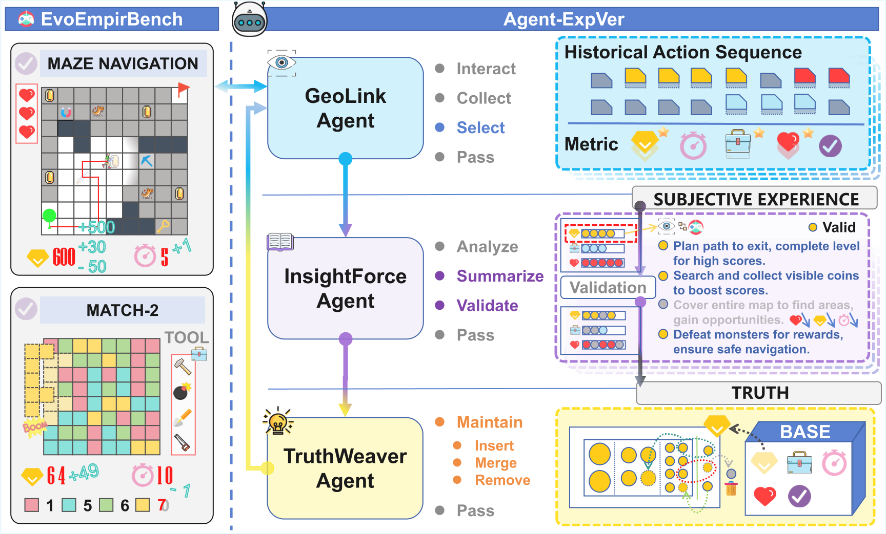
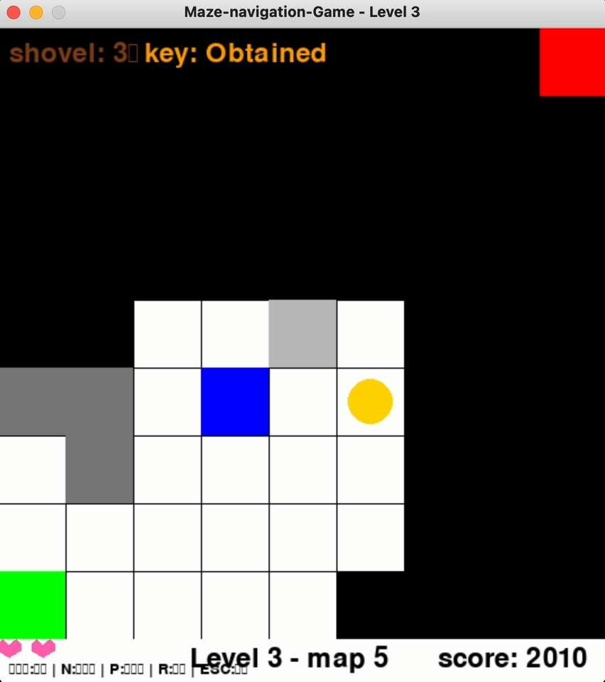
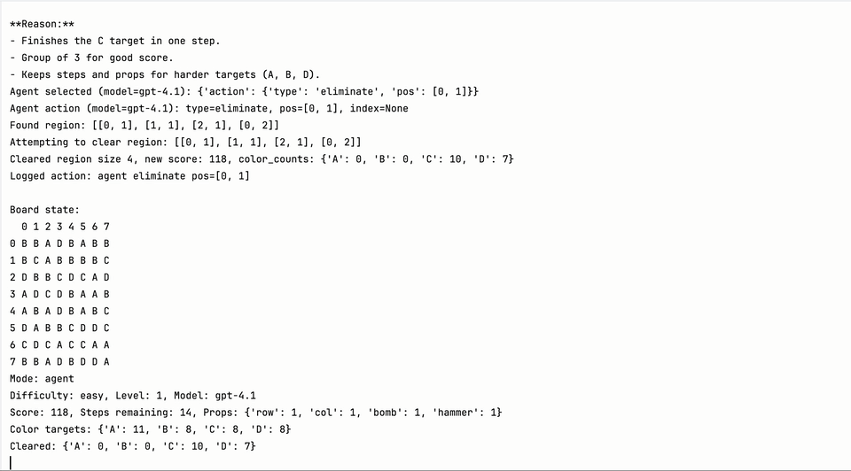

# EvoEmpirBench

Code artifact for **EvoEmpirBench: Dynamic Spatial Reasoning with Agent-ExpVer**.

EvoEmpirBench is a dynamic, partially observable benchmark for evaluating how language-model agents reason, plan, use tools, and adapt from experience in interactive spatial environments. The repository contains the core game environments, level assets, LLM-agent loops, experience abstraction modules, and evaluation scripts used for the Maze Navigation and Match-2 tasks.

**Paper:** [AAAI Proceedings](https://ojs.aaai.org/index.php/AAAI/article/view/40979) | [DOI](https://doi.org/10.1609/aaai.v40i43.40979) | [arXiv](https://arxiv.org/abs/2509.12718)



*Figure: EvoEmpirBench environments and the Agent-ExpVer workflow. GeoLink interacts with the environment, InsightForce abstracts and validates subjective experience, and TruthWeaver maintains verified truth knowledge for later episodes.*

## Paper Overview

Existing spatial-reasoning benchmarks are often static, fully observable, or weakly coupled to environment feedback. EvoEmpirBench targets a harder setting: agents must reason from local observations, update their belief as the environment changes, use tools when they matter, and optimize long-horizon goals rather than only answer a one-shot prompt.

The paper makes two linked contributions:

- **EvoEmpirBench**, a benchmark suite with Maze Navigation and Match-2 Elimination tasks across three difficulty levels.
- **Agent-ExpVer**, an online experience abstraction and verification framework that improves agents without parameter updates.

## Highlights

- **Dynamic spatial reasoning benchmark.** Two interactive environments test long-horizon planning under local perception, environment feedback, changing states, and global objectives.
- **Maze Navigation.** Agents navigate partially observed mazes, collect coins, avoid or defeat monsters, use tools, and reach the goal.
- **Match-2 Elimination.** Agents clear connected color blocks on an 8x8 board while balancing limited steps, color targets, and prop usage.
- **Agent-ExpVer.** A three-agent online learning framework that abstracts subjective experience, validates it through replay, and maintains reusable truth knowledge.
- **Clean reproducibility artifact.** Source code and lightweight level assets are kept; generated results, private credentials, local memories, caches, and editor files are excluded.

## Demo Cases

Click a thumbnail to open a short gameplay clip.

| Maze Navigation | Match-2 Elimination |
| --- | --- |
| [](docs/assets/demos/maze-navigation-demo.mp4) | [](docs/assets/demos/match2-demo.mp4) |

The full supplementary videos can be distributed through GitHub Releases or an external artifact host if you want to keep the repository itself lightweight.

## What Is Included

```text
.
├── src/
│   ├── agent/              # LLM agent interface, map parsing, reflection, learning, memory logic
│   ├── config/             # Game constants, API config, centralized project paths
│   ├── data_collector/     # Trajectory and interaction data collection
│   ├── game/               # Maze-navigation environment and map generator
│   ├── match_game/         # Match-2 environment, level generation, agent execution
│   └── memory/             # Auxiliary memory utilities
├── data/
│   └── levels/
│       ├── maze_eval/      # 90 maze evaluation maps plus 3 collection files
│       ├── maze_train/     # 30 maze training maps plus 3 collection files
│       └── match_game/     # 90 Match-2 levels across easy/medium/hard
├── docs/assets/
│   ├── figures/            # Paper figures used in this README
│   └── demos/              # Lightweight demo thumbnails and video clips
├── scripts/                # Map generation, training, evaluation, analysis, sanity checks
├── examples/               # Human and agent play examples
├── outputs/                # Runtime outputs, ignored by git
├── README.md
├── REPRODUCIBILITY.md
├── requirements.txt
├── pyproject.toml
└── .env.example
```

The single source of truth for default paths is `src/config/paths.py`.

## Benchmark Tasks

### Maze Navigation

The maze environment evaluates spatial reasoning under partial observability. The agent sees only a local field of view, takes directional movement actions, receives environment feedback, and must balance exploration, reward collection, risk, and goal completion.

| Level | Grid | Main setting |
| --- | --- | --- |
| Level 1 | 7x7 | 5 coins, no monsters |
| Level 2 | 9x9 | 5 coins, 2 moving monsters |
| Level 3 | 11x11 | 5 coins, 2 moving monsters, shovel, sword, magnet, key |

**Artifact note.** This released code follows the original three-scale maze setup above. If you compare against a manuscript snapshot that describes every maze level as 9x9, treat that sentence as stale relative to this implementation.

### Match-2 Elimination

The Match-2 environment evaluates planning over an 8x8 grid with four colors. The agent must clear connected same-color regions or use props while satisfying color-specific targets within limited steps.

| Difficulty | Step budget | Target range per color | Props |
| --- | --- | --- | --- |
| easy | 15-18 | 8-12 | row, column, bomb, hammer |
| medium | 12-15 | 12-16 | row, column, bomb, hammer |
| hard | 10-13 | 16-20 | row, column, bomb, hammer |

## Agent-ExpVer

Agent-ExpVer is the online learning mechanism built on top of EvoEmpirBench. It is organized as three collaborating agents:

| Component | Role | Code |
| --- | --- | --- |
| GeoLink Agent | Interacts with the environment, selects actions, and collects trajectories | `src/agent/agent_interface.py`, `src/agent/map_processor.py` |
| InsightForce Agent | Summarizes episode-level subjective experiences and validates whether they improve behavior | `src/agent/reflection_agent.py`, `src/agent/learning_agent.py` |
| TruthWeaver Agent | Maintains reusable truth knowledge by inserting, merging, de-duplicating, or rejecting memories | `src/agent/memory_manager.py`, `src/memory/memory_manager.py` |

At a high level, the loop is:

1. Interact with a partially observable game environment.
2. Store action histories, observations, rewards, and final metrics.
3. Abstract subjective experience from successful or informative trajectories.
4. Replay and validate whether the experience improves task performance.
5. Promote verified experience into a reusable truth repository.
6. Inject truth knowledge into later episodes through in-context prompting.

## Setup

```bash
python -m venv .venv
source .venv/bin/activate
pip install -r requirements.txt
cp .env.example .env
```

Set credentials in `.env` or in your shell environment:

```bash
DEFAULT_API_TYPE=openai
OPENAI_API_KEY=your_key_here
OPENAI_MODEL=gpt-4o
OPENAI_BASE_URL=https://api.openai.com/v1

# Optional DeepSeek-compatible configuration
DEEPSEEK_API_KEY=your_key_here
DEEPSEEK_MODEL=deepseek-chat
DEEPSEEK_BASE_URL=https://api.deepseek.com
```

Do not commit `.env` or raw model outputs.

## Quick Verification

Run the lightweight project check before sharing or evaluating the artifact:

```bash
python scripts/check_project.py
```

The check verifies required directories, parses level JSON files, checks maze dimensions, confirms generated artifact folders are absent, and scans source/docs for accidental `sk-...` style API key patterns.

For a headless machine or server, set:

```bash
export SDL_VIDEODRIVER=dummy
```

## Regenerate Level Assets

Maze evaluation maps:

```bash
python scripts/generate_maps.py --count 30 --save_dir data/levels/maze_eval
```

Maze training maps:

```bash
python scripts/generate_training_maps.py --count 10 --save_dir data/levels/maze_train
```

Match-2 levels are loaded from `data/levels/match_game`. If a difficulty folder or level file is missing, `src/match_game/general_game.py` can regenerate the missing level set.

## Run Examples

Human maze play:

```bash
python examples/play_with_maps.py
```

Baseline maze evaluation:

```bash
python scripts/evaluate_agent.py --api_type openai --model gpt-4o --mode "Level 1" --num_maps 3
```

Agent-ExpVer maze training:

```bash
python scripts/train_agent.py --api_type openai --model gpt-4o --mode "Level 3" --num_maps 3 --max_steps 100
```

Evaluate a learning agent:

```bash
python scripts/evaluate_learning_agent.py --api_type openai --model gpt-4o --mode "Level 3" --num_maps 3
```

Match-2 agent evaluation:

```bash
python src/match_game/general_game.py --model gpt-4o --auto-run
```

All generated logs, metrics, memory files, plots, and reports are written under `outputs/`.

## Evaluation Metrics

Maze Navigation reports task success and behavior-level diagnostics:

- `S.R.`: success rate
- `A.S.`: average score
- `A.St.`: average steps
- `A.Ex.`: average exploration rate
- `A.G.`: gold collection rate
- `R.HP`: remaining hit points
- `A.K.`: average monster kills
- `A.B.`: average barrier interactions

Match-2 reports completion, efficiency, and API-validity metrics:

- `S.R.`: success rate
- `A.S.`: average score
- `R/M.S`: remaining or missing steps
- `S./St.`: score per step
- `C./St.`: clearance per step
- `API E.`: API efficiency

## Representative Paper Results

The paper reports consistent gains from Agent-ExpVer on both games. A compact view of representative success-rate improvements is shown below; regenerate full metrics with the scripts in this repository for your own model/API setting.

| Model | Maze baseline | Maze + Agent-ExpVer | Match-2 baseline | Match-2 + Agent-ExpVer |
| --- | ---: | ---: | ---: | ---: |
| GPT-4.1 | 73.33 | 78.89 | 40.00 | 53.33 |
| Claude-3.7-Sonnet | 68.89 | 72.22 | 41.11 | 47.19 |
| Gemini-2.5-Flash | 45.56 | 64.44 | 37.78 | 37.78 |
| Qwen2.5-32B-Instruct | 42.22 | 54.44 | 33.33 | 41.11 |

See `REPRODUCIBILITY.md` for notes on reproducing the evaluation setup.

## Reproducibility Policy

Kept in the repository:

- Source code under `src/`, `scripts/`, and `examples/`
- Lightweight benchmark levels under `data/levels/`
- README figures and short demo clips under `docs/assets/`
- Configuration templates such as `.env.example`

Ignored or regenerated locally:

- API credentials and `.env`
- Evaluation results and model outputs
- Agent memories, session traces, and processed data
- Python caches, virtual environments, editor metadata, and logs

See `REPRODUCIBILITY.md` for a compact reproducibility checklist.

## Citation

If you use EvoEmpirBench or Agent-ExpVer, please cite:

```bibtex
@inproceedings{zhao2026evoempirbench,
  title     = {EvoEmpirBench: Dynamic Spatial Reasoning with Agent-ExpVer},
  author    = {Zhao, Pukun and Wang, Longxiang and Wang, Miaowei and Chen, Chen and Zhou, Fanqing and Huang, Haojian},
  booktitle = {Proceedings of the AAAI Conference on Artificial Intelligence},
  volume    = {40},
  number    = {43},
  pages     = {36564--36572},
  year      = {2026},
  doi       = {10.1609/aaai.v40i43.40979},
  url       = {https://doi.org/10.1609/aaai.v40i43.40979}
}
```

## License

This project is released under the MIT License. See `LICENSE` for details.
